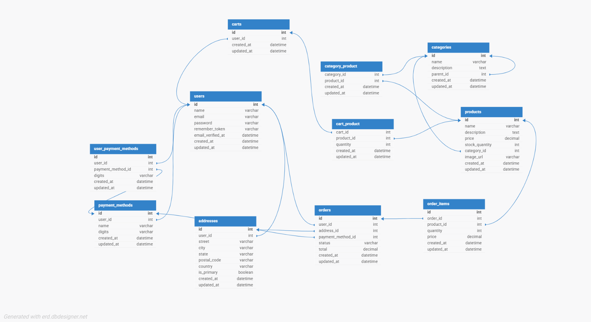
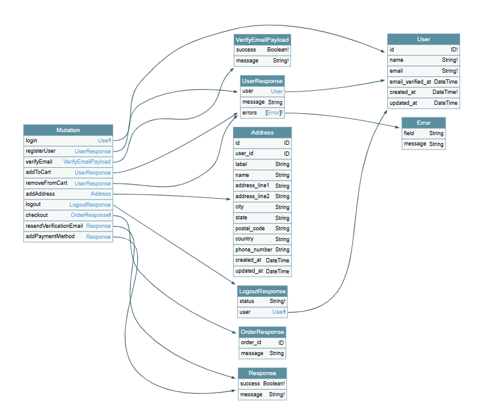
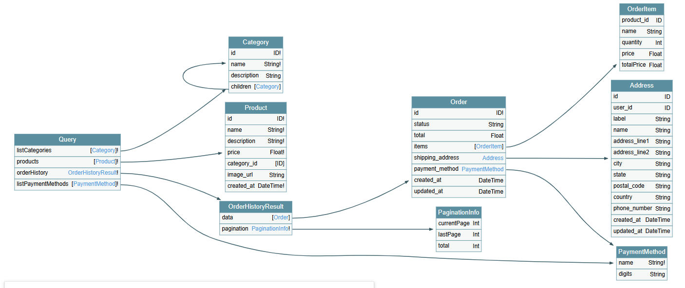

# E-commerce Web App

A robust and scalable **Ecommerce Web Application** backend built with **Laravel 11**, **GraphQL**, and **RESTful APIs**, designed for modern retail experiences. This project enables businesses to showcase products, manage inventory and orders, and deliver seamless shopping for customers.

[](https://laravel.com)
[](https://www.php.net/)
[](https://graphql.org/)

---

## 🚀 Features

### 🧑‍💻 Admin Panel (RESTful API)
- Manage Product Categories
- Create, Update, and Delete Products
- View Orders and Order Details
- Control Inventory and Stock Levels

### 🛍️ Customer Panel (GraphQL API)
- User Registration & Email Verification
- Product Browsing with Search, Sort, and Filters
- Shopping Cart Management
- Checkout and Order Placement
- Order Confirmation via Email

---

## 🛠️ Tech Stack

| Layer         | Technology                        |
|---------------|-----------------------------------|
| Backend       | Laravel 11, PHP 8.2               |
| Database      | MySQL                             |
| API Types     | REST (Admin), GraphQL (User)      |
| Authentication| Laravel Sanctum                   |
| Email         | Laravel Notifications & Mailables|
| Token Handling| Laravel Cache, Custom Token Logic |

---
### System Architecture


### ERD


### GraphQL Schema




## How to run?

### Clone this repo

```git
git clone https://github.com/malakabdelbaki/Ecommerce-Web-App.git
```

### run migrations
```bash
php artisan migrate 
php artisan db:seed
```

### Start Queue
```bash
php artisan queue:work --daemon
```

### To test user story 12: Admin Daily Email with Orders Spreadsheet
Please configure a tool like mailtrap or debugmail
run this command in terminal
```bash
php artisan email:daily-orders-report
```
